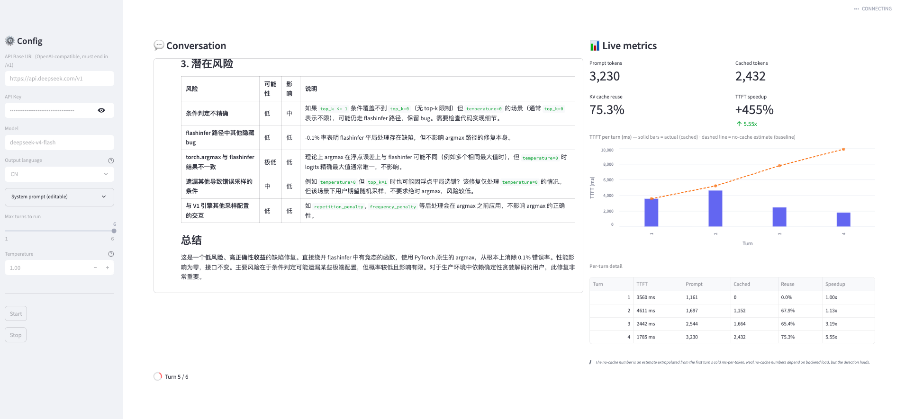

# kvpeek

A single-file Streamlit demo that shows **how KV prefix cache saves you prefill time and money** across a multi-turn conversation — using any OpenAI-compatible endpoint.



## What it does

Puts a senior LLM inference engineer into a 6-turn conversation analyzing a hardcoded vLLM release. The system prompt + reference data stay stable; the prompt grows every turn as the chat history accumulates.

Watch the chart on the right:

- **Solid bars** — actual TTFT (with cache on)
- **Dashed line** — no-cache estimate (extrapolated from turn 1's ms-per-token)
- **The gap** — prefill you didn't pay for

Live metrics: prompt tokens, cached tokens, KV cache reuse %, TTFT speedup.

## Quick start

```bash
pip install streamlit openai pandas altair
export OPENAI_BASE_URL="https://api.deepseek.com/v1"
export OPENAI_API_KEY="sk-..."
export OPENAI_MODEL="deepseek-v4-flash"
streamlit run app.py
```

Then open http://localhost:8501 and press **Start**.

Works with any OpenAI-compatible endpoint: vLLM, TensorMesh, OpenAI, DeepSeek, etc. Sidebar fields prefill from `OPENAI_BASE_URL` / `OPENAI_API_KEY` / `OPENAI_MODEL` env vars; override as needed.

## How the speedup is calculated

Turn 1 is a true cold start — no cache exists. We measure:

```
ms_per_token = turn1.ttft_ms / turn1.prompt_tokens
```

For each later turn, we extrapolate the no-cache cost and compare:

```
no_cache_estimate = ms_per_token × current_prompt_tokens
speedup            = no_cache_estimate / actual_ttft
```

Same baseline logic as the [TensorMesh multi-turn-chat demo](https://app.tensormesh.ai/lab/demos/multi-turn-chat).

## Caveats

- **No-cache baseline is extrapolated, not measured.** Real TTFT has constant overhead (queue, network, cold-start) the linear model ignores — speedup will read optimistic on long prompts. Treat the *direction* as signal, not the exact ratio.
- **TTFT only.** Decode latency and output cost are not modeled.
- **Requires the endpoint to return `usage.prompt_tokens_details.cached_tokens`.** OpenAI, DeepSeek, TensorMesh do. Self-hosted vLLM needs cache-hit accounting enabled in the OpenAI-compatible server.
- **5-minute cache TTL** is the typical default. Run the demo twice within 5 min and turn 1 will hit stale cache from the prior run. The app injects a random session marker on each Start to prevent that.

## The script

1. "Is this vLLM release a major or a hotfix? Why?"
2. "Pick PR1 from the release notes, walk me through it."
3. "PR1 author's GitHub background and recent activity?"
4. "Same deep-dive for PR2."
5. "Same for PR2's author."
6. "200-word synthesis of the release."

The release data and author profiles are inlined in `SNAPSHOT_RELEASE` near the top of `app.py`. Edit them to point at your own workload (PR review queue, support transcripts, anything growing over turns).

## Why one file

The whole demo is one screen of code, one set of scripted questions, one chart, one table. Five files would make it harder to read, not easier. If you want to embed it in a larger app, copy `call_llm()` and the metrics loop — that's the load-bearing part.

## License

MIT.
